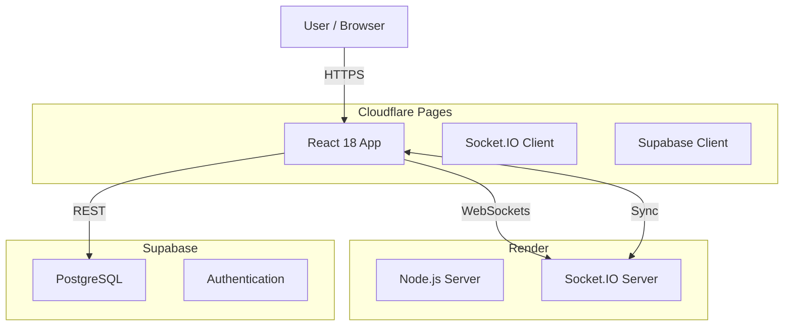

# XY Poker

A 2-player poker card game with both local and online multiplayer modes, featuring a high-stakes "XY" hand evaluation system and dynamic dice mechanics.

## 🚨 Critical Development Rules (MUST READ)

The following rules are **NON-NEGOTIABLE** and must be followed for every single update.

### 1. Version Update Policy
**バージョンは全てのアップデートで必ず更新すること**
- **Trigger:** Every single code change (no matter how small).
- **Format:** `MMDDHHMM` (Month/Day/Hour/Minute) e.g., `12131558`.
- **Location:** `src/App.tsx` inside `<span className="version">...</span>`.
- **Goal:** Ensure instantaneous verification of deployment status.

### 2. CSS Positioning Rules
**座標移動は必ずtransform translateYを使用すること**
- ❌ **NEVER** use `margin-top` or `top` for vertical offsets in animations/layout adjustments.
- ✅ **ALWAYS** use `transform: translateY(...)`.
- **Reason:** Margins cause reflows and unpredictable layout shifts.

### 3. Deployment Policy (STRICT)
**Sync is Critical.** You must use the unified deployment script:
1.  **Run Unified Deploy Script:**
    ```bash
    npm run deploy
    ```
    *(This runs `./deploy_all.sh`, which enforces Git Commit -> Cloudflare Upload -> Render Push)*
    
*Do not run `wrangler` or `git push` manually unless you know exactly what you are doing.*

### 4. README Maintenance
**全てのアップデートでREADMEを更新すること**
- Update the "Recent Changes" log.
- If logic changes, update the relevant documentation section.

---

## 🏗 System Architecture



---

## ✅ Handover Status

- **Current Version:** `12281646` (2025-12-28 16:46)
- **Status:** **Stable**
- **Last Critical Verification:**
    - Local vs AI: ✅ Working
    - Online Match: ✅ Working
    - Deployment: ✅ Automated via scripts
    - Code Health: ✅ Linting Improved

### Known Issues
- **None.** Codebase cleaned up.

---

## 📜 Recent Changes (Last 10 Updates)

1. **v12281646** (2025-12-28): **Dev Experience** - Added `npm run dev:all` to start both frontend and backend concurrently.
2. **v12162365** (2025-12-16): **Bug Fix** - Fixed issue where GameInfo persisted and header disappeared when returning to lobby from online matches (reset phase correctly).
3. **v12162361** (2025-12-16): **Refactor** - Moved "Sign Out" button from main screen to "My Page" modal for cleaner UI.
4. **v12162359** (2025-12-16): **UI Fix** - Enforced specific width/height on "Face Down" checkbox to strictly limit clickable area; removed manual text margins.
5. **v12162356** (2025-12-16): **UI Fix** - Decoupled "Face Down" text from checkbox click area on mobile; text is no longer interactive.
6. **v12162351** (2025-12-16): **UI Fix** - Constrained click area width for "Face Down" toggle on mobile by reducing padding and enforcing fit-content.
7. **v12162348** (2025-12-16): **UI Fix** - Removed excess whitespace and margins between "Face Down" checkbox and text on mobile.
8. **v12162344** (2025-12-16): **UI Fix** - Tightly coupled "Face Down" checkbox and text, and centered them to prevent cutoff on mobile.
9. **v12162337** (2025-12-16): **UI Fix** - Fixed alignment and positioning of "Face Down" card toggle on mobile devices.
10. **v12162334** (2025-12-16): **UI Fix** - Adjusted mobile Sign In button to be taller and narrower, sticking to the top-right corner.

---

## 💻 Local Development Setup

### 1. Prerequisites
- Node.js (v18+)
- Supabase Account

### 2. Environment Variables
Create `.env` in root:
```env
VITE_SUPABASE_URL=your_project_url
VITE_SUPABASE_KEY=your_anon_key
```

### 3. Quick Start
```bash
# Install dependencies
npm install
cd server && npm install && cd ..

# Start Dev Server (Frontend + Backend)
npm run dev:all   # Starts both servers concurrently (Recommended)
# OR manually:
npm run dev   # Frontend: http://localhost:5173
npm run start # Backend: http://localhost:3001
```

---

## 📦 Project Structure

```
xy-poker/
├── src/
│   ├── components/      # React components (Board, Dice, UI)
│   ├── logic/          # Core Game Logic (Pure Functions)
│   │   ├── game.ts     # Main Reducer
│   │   ├── evaluation.ts # Hand Evaluation
│   │   └── scoring.ts  # Score Calculation
│   └── App.tsx         # Main Controller & View Integration
├── server/
│   ├── index.js        # Socket.IO Server
│   └── db.js           # Database Client
└── README.md           # This file
```

## 🛠 Tech Stack
- **Frontend:** React 18, TypeScript, Vite
- **Styling:** Vanilla CSS (CSS Variables)
- **Realtime:** Socket.IO
- **Database:** Supabase

---

## 👑 Admin & Operations

### Managing Premium Users
To grant "Premium" status (Ad Removal) to a user, run the following SQL in the **Supabase SQL Editor**:

```sql
-- Option 1: By Email (Recommended)
UPDATE players
SET is_premium = TRUE
WHERE id = (SELECT id FROM auth.users WHERE email = 'target_user@example.com');

-- Option 2: By Username (If unique and known)
-- Note: 'username' is in 'players' table
UPDATE players
SET is_premium = TRUE
WHERE username = 'UserDisplayName';
```

To revoke, set `is_premium = FALSE`.

