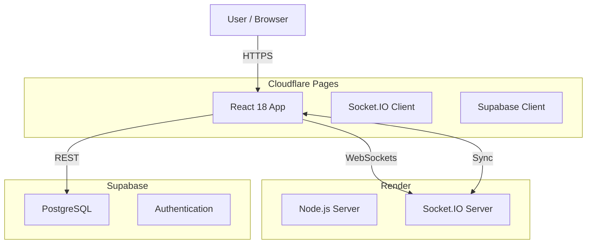

# XY Poker

A 2-player poker card game with both local and online multiplayer modes, featuring a high-stakes "XY" hand evaluation system and dynamic dice mechanics.

## 🚨 Critical Development Rules (MUST READ)

The following rules are **NON-NEGOTIABLE** and must be followed for every single update.

### 1. Version Update Policy
**バージョンは全てのアップデートで必ず更新すること**
- **Trigger:** Every single code change (no matter how small).
- **Format:** `MMDDHHMM` (Month/Day/Hour/Minute) e.g., `12131558`.
- **Location:** `src/App.tsx` inside `<span className="version">...</span>`.
- **Goal:** Ensure instantaneous verification of deployment status.

### 2. CSS Positioning Rules
**座標移動は必ずtransform translateYを使用すること**
- ❌ **NEVER** use `margin-top` or `top` for vertical offsets in animations/layout adjustments.
- ✅ **ALWAYS** use `transform: translateY(...)`.
- **Reason:** Margins cause reflows and unpredictable layout shifts.

### 3. Deployment Policy (STRICT)
**Sync is Critical.** You must perform **BOTH** steps for every update:
1.  **Frontend (Cloudflare Pages):**
    ```bash
    npm run deploy
    ```
2.  **Backend/Source (Render & GitHub):**
    ```bash
    git push origin main
    ```
*Failure to do both will result in "Version Mismatch" errors and broken multiplayer states.*

### 4. README Maintenance
**全てのアップデートでREADMEを更新すること**
- Update the "Recent Changes" log.
- If logic changes, update the relevant documentation section.

---

## 🏗 System Architecture



---

## ✅ Handover Status

- **Current Version:** `12131558` (2025-12-13 15:58)
- **Status:** **Stable**
- **Last Critical Verification:**
    - Local vs AI: ✅ Working (Fixed crash & animation)
    - Online Match: ✅ Working
    - Deployment: ✅ Automated via scripts

### Known Issues
- **None.** All recent critical bugs (White Screen crash, AI deadlock, Animation persistence) have been resolved.

---

## 📜 Recent Changes (Last 10 Updates)

1. **v12131558** (2025-12-13): **Fix** - Fixed missing result animation when playing a second Local game (reset scoring trigger).
2. **v12131555** (2025-12-13): **Fix** - Prevented AI and Auto-Play from making moves while the Dice Roll Animation is still visible.
3. **v12131260** (2025-12-13): **Critical Fix** - Fixed "White Screen" crash in Local Battle caused by premature scoring trigger.
4. **v12131255** (2025-12-13): **Fix** - Fixed Local AI inactivity by ensuring AI turn logic reacts to phase transitions.
5. **v12131250** (2025-12-13): **Fix** - Restored missing phase synchronization logic that fixed lobby redirect loops.
6. **v12131240** (2025-12-13): **Fix** - Resolved GameInfo persistence bug and internal syntax errors.
7. **v12131220** (2025-12-13): **Revert** - **Full Revert** to v12131140 state, cancelling Cinematic Scoring features.
8. **v12131140** (2025-12-13): **Fix** - Fixed "FINISH" text overflowing on mobile screens (`clamp`).
9. **v12112356** (2025-12-11): **UI** - Restored "Rules" button in Online Lobby and Local Setup screen.
10. **v12112354** (2025-12-11): **Fix** - Corrected "Pure Straight" detection logic.

---

## 💻 Local Development Setup

### 1. Prerequisites
- Node.js (v18+)
- Supabase Account

### 2. Environment Variables
Create `.env` in root:
```env
VITE_SUPABASE_URL=your_project_url
VITE_SUPABASE_KEY=your_anon_key
```

### 3. Quick Start
```bash
# Install dependencies
npm install
cd server && npm install && cd ..

# Start Dev Server (Frontend + Backend)
npm run dev   # Frontend: http://localhost:5173
npm run start # Backend: http://localhost:3000
```

---

## 📦 Project Structure

```
xy-poker/
├── src/
│   ├── components/      # React components (Board, Dice, UI)
│   ├── logic/          # Core Game Logic (Pure Functions)
│   │   ├── game.ts     # Main Reducer
│   │   ├── evaluation.ts # Hand Evaluation
│   │   └── scoring.ts  # Score Calculation
│   └── App.tsx         # Main Controller & View Integration
├── server/
│   ├── index.js        # Socket.IO Server
│   └── db.js           # Database Client
└── README.md           # This file
```

## 🛠 Tech Stack
- **Frontend:** React 18, TypeScript, Vite
- **Styling:** Vanilla CSS (CSS Variables)
- **Realtime:** Socket.IO
- **Database:** Supabase
