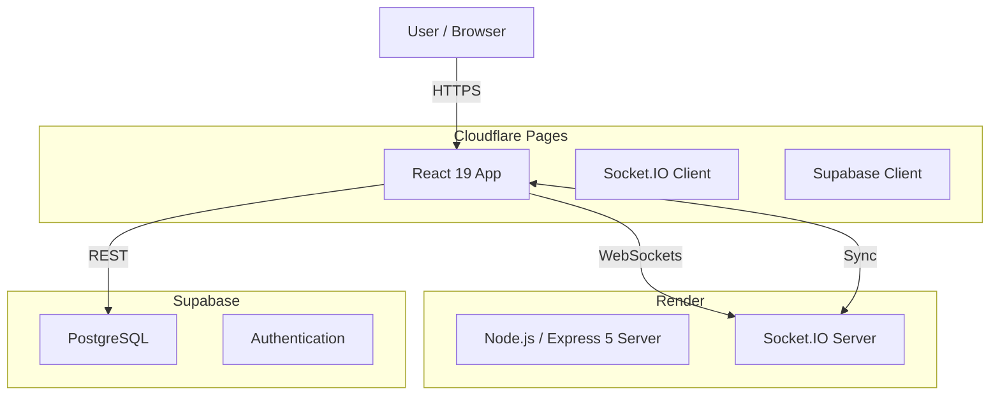

# XY Poker

A 2-player poker card game with both local and online multiplayer modes, featuring a high-stakes "XY" hand evaluation system, dynamic dice mechanics, AI opponents, a skin gacha store, and a premium subscription tier.

## 🚨 Critical Development Rules (MUST READ)

The following rules are **NON-NEGOTIABLE** and must be followed for every single update.

### 1. Version Update Policy
**バージョンは全てのアップデートで必ず更新すること**
- **Trigger:** Every single code change (no matter how small).
- **Format:** `MMDDHHMM` (Month/Day/Hour/Minute) e.g., `12131558`.
- **Location:** `src/App.tsx` inside `<span className="version">...</span>`.
- **Goal:** Ensure instantaneous verification of deployment status.

### 2. CSS Positioning Rules
**座標移動は必ずtransform translateYを使用すること**
- ❌ **NEVER** use `margin-top` or `top` for vertical offsets in animations/layout adjustments.
- ✅ **ALWAYS** use `transform: translateY(...)`.
- **Reason:** Margins cause reflows and unpredictable layout shifts.

### 3. Deployment Policy (STRICT)
**Sync is Critical.** You must use the unified deployment script:
1.  **Run Unified Deploy Script:**
    ```bash
    npm run deploy
    ```
    *(This runs `./deploy_all.sh`, which enforces Git Commit -> Cloudflare Upload -> Render Push)*
    
*Do not run `wrangler` or `git push` manually unless you know exactly what you are doing.*

### 4. README Maintenance
**全てのアップデートでREADMEを更新すること**
- Update the "Recent Changes" log.
- If logic changes, update the relevant documentation section.

---

## 🏗 System Architecture


```mermaid
graph TD
    User[User / Browser]
    
    subgraph Frontend [Cloudflare Pages]
        React[React 19 App]
        SocketClient[Socket.IO Client]
        SupabaseClient[Supabase Client]
    end
    
    subgraph Backend [Render]
        NodeServer[Node.js / Express 5 Server]
        SocketServer[Socket.IO Server]
    end
    
    subgraph Database [Supabase]
        Postgres[PostgreSQL]
        Auth[Authentication]
    end
    
    User -->|HTTPS| React
    React -->|WebSockets| SocketServer
    React -->|REST| Postgres
    SocketServer <-->|Sync| React
```

---

## ✅ Handover Status

- **Current Version:** `06251316` (2026-06-25 13:16)
- **Status:** **Stable**
- **Last Critical Verification:**
    - Local vs AI: ✅ Working
    - Online Match: ✅ Working
    - Deployment: ✅ Automated via scripts
    - Code Health: ✅ Linting Improved

### Known Issues
- **None.** Codebase is stable.

---

## 📜 Recent Changes (Last 10 Updates)

1. **v06251316** (2026-06-25): **AI Enhancement** - Overhauled local AI (Level 1 & 2). Introduced probability calculations, dynamic risk assessment, strategic bluffing (Face Down), and Monte Carlo expected value (EV) simulations for smarter placements.
2. **v06251123** (2026-06-25): **Security Update** - Addressed critical vulnerabilities. Fixed RLS policies to prevent cheating, added JWT validation for sockets, restricted CORS, fixed kickers logic bug, and secured game end reporting.
2. **v06151539** (2026-06-15): **Docs** - Fully updated README.md to reflect current project state (React 19, full component list, all features).
2. **v12281646** (2025-12-28): **Dev Experience** - Added `npm run dev:all` to start both frontend and backend concurrently.
3. **v12162365** (2025-12-16): **Bug Fix** - Fixed issue where GameInfo persisted and header disappeared when returning to lobby from online matches (reset phase correctly).
4. **v12162361** (2025-12-16): **Refactor** - Moved "Sign Out" button from main screen to "My Page" modal for cleaner UI.
5. **v12162359** (2025-12-16): **UI Fix** - Enforced specific width/height on "Face Down" checkbox to strictly limit clickable area; removed manual text margins.
6. **v12162356** (2025-12-16): **UI Fix** - Decoupled "Face Down" text from checkbox click area on mobile; text is no longer interactive.
7. **v12162351** (2025-12-16): **UI Fix** - Constrained click area width for "Face Down" toggle on mobile by reducing padding and enforcing fit-content.
8. **v12162348** (2025-12-16): **UI Fix** - Removed excess whitespace and margins between "Face Down" checkbox and text on mobile.
9. **v12162344** (2025-12-16): **UI Fix** - Tightly coupled "Face Down" checkbox and text, and centered them to prevent cutoff on mobile.
10. **v12162337** (2025-12-16): **UI Fix** - Fixed alignment and positioning of "Face Down" card toggle on mobile devices.

---

## 💻 Local Development Setup

### 1. Prerequisites
- Node.js (v18+)
- Supabase Account

### 2. Environment Variables
Create `.env` in root:
```env
VITE_SUPABASE_URL=your_project_url
VITE_SUPABASE_KEY=your_anon_key
```

Also create `server/.env`:
```env
SUPABASE_URL=your_project_url
SUPABASE_SERVICE_KEY=your_service_role_key
```

### 3. Quick Start
```bash
# Install dependencies
npm install
cd server && npm install && cd ..

# Start Dev Server (Frontend + Backend)
npm run dev:all   # Starts both servers concurrently (Recommended)
# OR manually:
npm run dev   # Frontend: http://localhost:5173
npm run start # Backend: http://localhost:3001
```

---

## 📦 Project Structure

```
xy-poker/
├── src/
│   ├── components/           # React UI Components
│   │   ├── AuthModal.tsx     # Sign-in / Sign-up modal
│   │   ├── Board.tsx         # Game board layout
│   │   ├── Card.tsx          # Individual card display
│   │   ├── ContactForm.tsx   # Contact / feedback form
│   │   ├── DevBadge.tsx      # Developer indicator badge
│   │   ├── Dice.tsx          # Dice face display
│   │   ├── DiceRollOverlay.tsx # Dice roll animation overlay
│   │   ├── GachaReveal.tsx   # Gacha skin reveal animation
│   │   ├── GameInfo.tsx      # In-game score/info panel
│   │   ├── GameResult.tsx    # Post-game result screen
│   │   ├── Hand.tsx          # Player hand display
│   │   ├── Lobby.tsx         # Main lobby screen
│   │   ├── MonetagBanner.tsx # Ad banner wrapper
│   │   ├── MyPage.tsx        # User profile & premium management
│   │   ├── RewardAdButton.tsx# Rewarded ad button (skin tickets)
│   │   ├── RulesModal.tsx    # Game rules explanation
│   │   ├── ScoringOverlay.tsx# Step-by-step score reveal overlay
│   │   ├── SharedBoard.tsx   # Shared board for online play
│   │   ├── SkinStore.tsx     # Gacha skin store UI
│   │   └── TurnTimer.tsx     # Per-turn countdown timer
│   │
│   ├── logic/                # Core Game Logic (Pure Functions)
│   │   ├── ai.ts             # AI opponent best-move engine
│   │   ├── aiLearning.ts     # AI learning & game result recording
│   │   ├── deck.ts           # Deck creation & shuffling
│   │   ├── evaluation.ts     # Hand evaluation (X / Y hands)
│   │   ├── game.ts           # Main game reducer & state machine
│   │   ├── gamification.ts   # Player stats & achievements system
│   │   ├── nameGenerator.ts  # Random player name generator
│   │   ├── online.ts         # Socket.IO client connection manager
│   │   ├── scoring.ts        # Score calculation
│   │   └── types.ts          # Shared TypeScript type definitions
│   │
│   ├── utils/
│   │   ├── identity.ts       # Browser fingerprint / guest ID
│   │   └── sound.ts          # Sound effects & TTS management
│   │
│   ├── App.tsx               # Main controller & view integration
│   ├── App.css               # Global application styles
│   ├── index.css             # CSS reset / root variables
│   ├── main.tsx              # React entry point
│   └── supabase.ts           # Supabase client initializer
│
├── server/
│   ├── index.js              # Socket.IO + Express 5 server
│   ├── db.js                 # Supabase server-side client
│   └── package.json          # Server-side dependencies
│
├── supa_schema.sql           # Initial Supabase schema
├── supa_schema_v2~v5_*.sql   # Incremental schema migrations
├── deploy_all.sh             # Unified deployment script
├── vite.config.ts            # Vite build configuration
└── README.md                 # This file
```

---

## 🎮 Feature Overview

| Feature | Description |
|---------|-------------|
| **Local Battle** | 2-player on same device |
| **AI Battle** | Play against a trained AI opponent |
| **Online Match** | Real-time 1v1 via Socket.IO (Quick Match / Room Code) |
| **Ranked Games** | ELO-style rating system for online matches |
| **Skin Gacha Store** | Earn tickets via rewarded ads; unlock card / dice / board skins |
| **Premium Tier** | Ad-free experience managed via Supabase (`is_premium` flag) |
| **Achievements** | In-game achievement & stats tracking |
| **Turn Timer** | 60-second per-turn countdown |
| **Audio / TTS** | Sound effects + text-to-speech for game events |
| **PWA Ready** | iOS audio unlock & browser fingerprint for guest play |

---

## 🛠 Tech Stack

| Layer | Technology |
|-------|-----------|
| **Frontend** | React 19, TypeScript, Vite 7 |
| **Styling** | Vanilla CSS (CSS Variables) |
| **Realtime** | Socket.IO 4 |
| **Backend** | Node.js, Express 5 |
| **Database** | Supabase (PostgreSQL) |
| **Auth** | Supabase Auth |
| **Hosting (FE)** | Cloudflare Pages |
| **Hosting (BE)** | Render |
| **Ads** | Monetag |

---

## 👑 Admin & Operations

### Managing Premium Users
To grant "Premium" status (Ad Removal) to a user, run the following SQL in the **Supabase SQL Editor**:

```sql
-- Option 1: By Email (Recommended)
UPDATE players
SET is_premium = TRUE
WHERE id = (SELECT id FROM auth.users WHERE email = 'target_user@example.com');

-- Option 2: By Username (If unique and known)
-- Note: 'username' is in 'players' table
UPDATE players
SET is_premium = TRUE
WHERE username = 'UserDisplayName';
```

To revoke, set `is_premium = FALSE`.

### Database Schema Migrations
Schema migrations are tracked as incremental SQL files at the root:
- `supa_schema.sql` — Initial schema
- `supa_schema_v2.sql` ~ `supa_schema_v5_contact.sql` — Incremental patches

Apply in order when setting up a new Supabase project.
