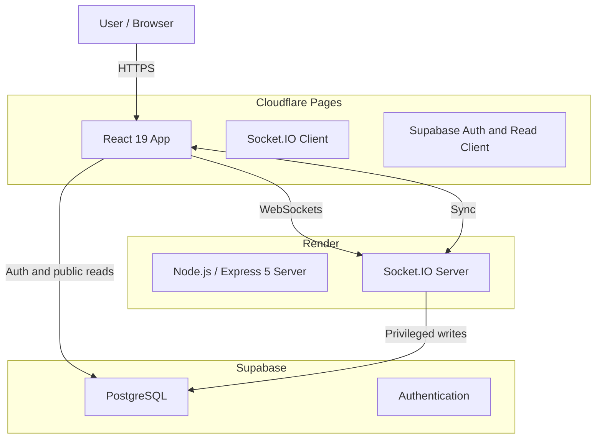

# XY Poker

A 2-player poker card game with both local and online multiplayer modes, featuring a high-stakes "XY" hand evaluation system, dynamic dice mechanics, AI opponents, a skin gacha store, and a premium subscription tier.

## 🚨 Critical Development Rules (MUST READ)

The following rules are **NON-NEGOTIABLE** and must be followed for every single update.

### 1. Version Update Policy
**バージョンは全てのアップデートで必ず更新すること**
- **Trigger:** Every single code change (no matter how small).
- **Format:** `MMDDHHMM` (Month/Day/Hour/Minute) e.g., `12131558`.
- **Location:** `src/App.tsx` inside `<span className="version">...</span>`.
- **Goal:** Ensure instantaneous verification of deployment status.

### 2. CSS Positioning Rules
**座標移動は必ずtransform translateYを使用すること**
- ❌ **NEVER** use `margin-top` or `top` for vertical offsets in animations/layout adjustments.
- ✅ **ALWAYS** use `transform: translateY(...)`.
- **Reason:** Margins cause reflows and unpredictable layout shifts.

### 3. Deployment Policy (STRICT)
**Sync is Critical.** You must use the unified deployment script:
1.  **Run Unified Deploy Script:**
    ```bash
    npm run deploy
    ```
    *(This runs `./deploy_all.sh`, which enforces Git Commit -> Cloudflare Upload -> Render Push)*
    
*Do not run `wrangler` or `git push` manually unless you know exactly what you are doing.*

### 4. README Maintenance
**全てのアップデートでREADMEを更新すること**
- Update the "Recent Changes" log.
- If logic changes, update the relevant documentation section.

---

## 🏗 System Architecture


```mermaid
graph TD
    User[User / Browser]
    
    subgraph Frontend [Cloudflare Pages]
        React[React 19 App]
        SocketClient[Socket.IO Client]
        SupabaseClient[Supabase Auth and Read Client]
    end
    
    subgraph Backend [Render]
        NodeServer[Node.js / Express 5 Server]
        SocketServer[Socket.IO Server]
    end
    
    subgraph Database [Supabase]
        Postgres[PostgreSQL]
        Auth[Authentication]
    end
    
    User -->|HTTPS| React
    React -->|WebSockets| SocketServer
    React -->|Auth and public reads| Postgres
    SocketServer -->|Privileged writes| Postgres
    SocketServer <-->|Sync| React
```

---

## ✅ Handover Status

- **Current Version:** `09021343` (2026-09-02 13:43)
- **Status:** **Local quality gate in progress; production deployment pending**
- **Last Critical Verification:**
    - Local vs AI: ✅ Start flow, turn selection, card placement working
    - Online Match: ✅ Responsive lobby and connection state verified locally
    - Responsive UI: ✅ Japanese/English home and rules checked at 320×568, 390×844, and 1440×900
    - Repository lint: ✅ 0 errors / 0 warnings
    - Automated tests: ✅ 44 passing
    - Production Build: ✅ TypeScript and Vite build passing; largest app chunk ~313 kB, no 500 kB warning
    - Dependency audit: ✅ 0 known vulnerabilities in root and server packages
    - Deployment: ⏳ `v09021343` deployment pending

### Database status
- `supa_schema_v9_game_records.sql` applied to production with owner-only RLS.
- Render uses the server-side Supabase client for validated game-record writes.

---

## 📜 Recent Changes (Last 10 Updates)

1. **v09021343** (2026-09-02): **PRO Move-Reasoning Journal** - Added an in-match PRO-only thought editor that attaches up to 280 characters of strategic reasoning to the player’s next manual move. Notes are stored with the exact card, column, row, visibility, and draw in game-record schema v3; shown at the matching replay position; and included in localized TXT exports. Client and server validators reject notes on opponent moves, malformed text, legacy-schema injection, and oversized records, while cloud saves containing notes require a server-verified PRO profile. AUTO and timeout moves cannot inherit stale human notes.
1. **v09021321** (2026-09-02): **Balanced Replay Dice & Text Export** - Reduced replay-only dice from 40–72 px to a compact responsive 28–36 px so the board’s cards and placements remain visually dominant without changing live-match dice. Added localized UTF-8 TXT exports containing match metadata, all five dice, both initial hands when available, every placement and draw, face-up/face-down history, bonuses, scores, and final boards. Legacy records remain exportable with unavailable hand data identified explicitly.
1. **v09021311** (2026-09-02): **Column-Triage GTO A7** - Fixed a strategic inversion where stronger visible opponent columns received a larger unconditional contest bonus, causing the AI to feed scarce cards into likely-lost lanes. A7 applies a validated negative response pressure so it sacrifices bad matchups and concentrates cards on winnable dice. Independent 3,000-pair tests beat A6 on random, 66611, and 65421 boards with positive 95% lower bounds; a separate 10,000-pair audit measured +0.0505 utility and reduced 15-point blowout losses by about 19.6%. Two-seed, 1,000 ms search-versus-search regression finished 8-7-1 while maintaining 61.28/64 belief samples. Added reproducible A6/A7 generation selection and search-opponent benchmarking.
1. **v09021205** (2026-09-02): **Cross-Column GTO A6** - Added an exact hand-resource shadow price across all two-card Y columns so the AI preserves uniquely valuable completion cards for Pure Straights, trips, flushes, and other roles instead of only protecting queens. The opportunity cost is dice-weighted and attenuated on polarized cheap-column bonus races. Across 8,000 paired deals spanning random, 66611, 65421, and 44444 boards, the equal-regime descriptive improvement over A4 was +0.0205 utility with an approximate 95% interval of [+0.0017, +0.0393]. Tested and rejected public-showdown overreaction and secured-opening first-mover bonuses, then integrated A6 into both the 20% prior and 1,000 ms information-set rollout policy. Cached per-state best/second-best completions restored runtime density to 61.14/64 belief samples on the final audit.
1. **v09021003** (2026-09-02): **Japanese / English Localization** - Added a shared application-wide i18n layer with Japanese as the default language and a persistent `Language` selector on the home screen. Localized the home, match flow, online lobby, rules and hand rankings, authentication, feedback, skin shop and gacha, My Page, game records, result tables, timers, scoring, accessibility labels, alerts, document metadata, and showdown hand names. Japanese showdown speech now selects a Japanese system voice when available. Added catalog parity/default-language tests and verified instant switching plus reload persistence at phone and desktop viewports.
1. **v09020904** (2026-09-02): **Generalized Information-Set GTO A5** - Rebalanced the complete A4 policy with a confirmed PSRO response, added exact first-row route/kicker economics and cross-column Q opportunity cost, and re-solved a 12-policy population over 396,000 terminal games. A4 received 100% population support and beat A3 across random, 66611, 65421, and 22211 dice regimes in separate 5,000-pair tests. Replaced the 400 ms / 20-sample runtime with a 1,000 ms / 64-sample A5 search that broadly evaluates up to 60 card-column-face actions, progressively narrows to 16, samples only information-set-consistent worlds, and plays every candidate through all draws, Y/X scoring, bonuses, and opponent responses. A rotating-policy regression scored 28-10-2; a tempting multi-opponent rollout variant was measured at 21-16-3 and deliberately rejected.
1. **v09020645** (2026-09-02): **Hand-Efficiency GTO A3** - Corrected a structural role-value error where the completed evaluator knew Pure Straight was Rank 6 but the construction prior valued a two-card pair far above an ordered straight prefix, causing its own rollouts to reinforce the mistake. Added exact enumeration of all 132,600 ordered Y hands, actionable Pure Straight prefix/held-card analysis, 4,000-game paired policy studies, role-frequency reporting, half/double strength sensitivity tests, and a ten-policy re-solve. A3 increased Pure Straights from 0.581 to 2.396 per game and beat A2 by +0.3680 utility on random dice; the hand-efficiency policy received 100% equilibrium support and no independently confirmed mutation improved it.
1. **v09020623** (2026-09-02): **Dice-Regime GTO A2** - Re-audited the strategy after finding that A1 turn-order selection ignored dice entirely and its placement prior could not distinguish equal-mean `66611` from `44444`. Added public-board mean, variance, standard deviation, range, cheap-column opportunity cost, dynamic Y/X allocation, card-to-stake alignment, and conditional completion-race value to both turn selection and every rollout. Re-solved the nine-policy meta-game over 43,200 paired-seat games, where the regime-adaptive policy received 100% population support. A separate fixed-dice study over 2,000 games per regime found A2 beat A1 on `66611` by +0.105 utility with a 95% interval of [+0.062, +0.148], while proving that unconditional low-column rushing is exploitable outside polarized boards. Production belief rollout beat A1 28-11-1 on a 40-game `66611` audit at 95 ms average decision time.
1. **v09020039** (2026-09-02): **PRO AI Auto Play** - Added a persistent PRO-only AUTO control for local and online matches. When enabled, the same information-set-safe strategic AI now chooses lead/follow after a coin-toss win and performs every card, column, and face-down decision for the signed-in PRO player while manual match controls are locked. Opponent turns remain client-isolated, AUTO can be stopped at any time, and the 60-second safety action now uses the strategic AI instead of a random, partially invalid column picker.
1. **v09020022** (2026-09-02): **Full-Rule Belief Rollout AI** - Replaced the timeout-prone pseudo-Expectimax path with information-set-safe, full-match rollouts driven by the real game reducer. Every completed rollout now includes standard draws, column-completion bonus draws, turn passing, Y/X scoring, and terminal wins; true opponent hands, hidden identities, and deck order remain inaccessible. Fixed production policy weights are no longer overwritten by crowd telemetry. A reproducible paired benchmark over 60 games beat the former one-step runtime fallback 43-16-1 while completing all 20 belief samples in an average 91 ms per decision.
2. **v09012358** (2026-09-01): **Hand-Aware Game Record Replay** - Added backward-compatible record schema v2 with both initial hands and per-move draw data, deterministic hand reconstruction at every replay position, strict client/server hand-evolution validation under the existing 25 kB database limit, a legacy-record notice, and a compact responsive replay stage that shows both players' current hands around the board.
2. **v09012337** (2026-09-01): **Always-Visible Hand Layout** - Replaced the fixed-width, centered overflow strip with evenly shrinking, aspect-ratio-preserving hand cards so every card remains visible and selectable as bonus draws increase the hand size on phone, tablet, and desktop layouts. Made the unified release script work in restored environments that provide Node.js without globally installed npm/npx shims.
2. **v09012325** (2026-09-01): **Physical Coin-Toss Sound** - Replaced the continuous electronic LFO tone with a timed thumb flick, short edge-flip ticks, and a hard-surface landing built from inharmonic metal partials and tiny filtered contact-noise bursts synchronized to the 1.4-second toss.
2. **v09012319** (2026-09-01): **Dual-Color X-Hand Showdown** - Preserved the gold X-hand identity while carrying the blue or red winner color through the background glow, diagonal panels, streaks, shards, card edges, hand banner, and winner badge.
3. **v09012310** (2026-09-01): **Showdown Cut-In Overhaul** - Rebuilt showdown reveals with staggered left-to-right winning-card slides, finite diagonal cut-ins, speed lines, light shards, impact typography, synchronized spoken hand names, a lightweight synthesized stinger, a gold final X-hand climax, and reduced-motion fallbacks without video or bitmap effect assets.
4. **v09012256** (2026-09-01): **Visible X-Hand Result** - Removed the nested result-table scroll trap so the final X-hand row is always rendered with both hand names and scores; short screens now scroll the complete result modal instead.
5. **v09012249** (2026-09-01): **Authenticated Home Header Fix** - Moved signed-in email and player ID into the responsive player block, removed duplicate header metadata, and constrained long account identifiers to prevent overlap with the version label.
6. **v09012237** (2026-09-01): **GTO Runtime AI** - Connected XY-GTO-A1 to production move selection with a 72% normalized GTO prior, GTO-derived turn-order and concealment behavior, belief sampling for both opponent hands and hidden board cards, canonical unseen-deck identities, hidden-information-safe root evaluation, fair timeout fallback, and full-game legality regression tests.
2. **v09012214** (2026-09-01): **Approximate GTO / 近似GTO** - Added a reproducible PSRO-style self-play solver, paired seat/deal variance reduction, regret-matching+ meta-game solution, independent best-response validation, machine-readable results, unit tests, and a Japanese methodology/results report with explicit exact-solution limitations.
3. **v09012158** (2026-09-01): **Game Records / 棋譜** - Added compact 30-move match recording for AI, ranked, and private games; resilient local storage plus authenticated Supabase sync; server-side payload validation; owner-only RLS; and a responsive My Page archive with move-by-move board replay.
1. **v09011603** (2026-09-01): **Developer Support Link** - Added a restrained, responsive OFUSE support button to the home footer with safe external-link behavior and keyboard focus styling.
2. **v09011601** (2026-09-01): **Repository Hardening & Performance** - Cleared all repository lint debt, added reducer/server tests and a single `npm run check` quality gate, split React/Supabase/realtime/lazy feature bundles to remove the 500 kB warning, upgraded dependencies to zero known audit vulnerabilities, removed committed `node_modules` and obsolete mutation scripts/assets, hardened multiplayer input/auth/rate limits and server-authoritative rewards, locked sensitive Supabase writes behind the backend, added Cloudflare Pages caching/security headers, and made setup/deployment scripts portable and fail-safe.
3. **v09011511** (2026-09-01): **Minimal Responsive UI Overhaul** - Rebuilt the home, online lobby, game board, rules, authentication, scoring, and showdown surfaces around a restrained responsive design. Removed the home character and excessive visual effects, fixed duplicate long-press/click placement behavior, shortened and stabilized dice/coin animations with timer cleanup and reduced-motion support, added keyboard-accessible board columns, and verified the core flow across phone, tablet, and landscape layouts.
1. **v06301048** (2026-06-30): **Migration Verification** - Deployed a minor version bump from the new development environment to verify that deployment scripting, credentials, and repository syncing are functioning correctly on the new Mac.
1. **v06291657** (2026-06-29): **Preset Ultimate Evolutionary AI** - Synchronized the default fallback weights in `ai.ts` and `aiLearning.ts` to match the optimized release state parameters (Pure ratio, Trips concealed, Showdown delays, low card penalties, and defensive focus), ensuring the AI behaves at its absolute maximum evolutionary strength right from launch without waiting for player updates.
1. **v06291649** (2026-06-29): **12-Parameter Collaborative Strategy AI Upgrade** - Fully integrated all strategic requirements from `strategy.md` and "Pure" vs "Unordered" hand differences into the collective learning loop. (1) Created `supa_schema_v7_ai.sql` mapping 12 distinct parameters. (2) Extended the database schema to track Pure hand preferences, trips in hand concealing, row-3 delay penalties, showdown delay (slow playing), low card avoidance, and turn order selection flexibility. (3) Updated `ai.ts` to scale structural heuristic penalties/bonuses based on dynamic global parameters, achieving true strategy-level evolutionary learning.
1. **v06291613** (2026-06-29): **Collaborative AI Learning Upgrade** - Built a **Distributed Collaborative Evolutionary AI system** that aggregates training metrics from all players. (1) Created `ai_global_parameters` table in Supabase. (2) Configured the client to fetch latest global AI weights (preferences for Flush/Straight/Trips/Defensiveness) on startup and game start. (3) Programmed the database client to automatically report AI game end outcomes, continuously fine-tuning global AI weights based on collective games played worldwide.
1. **v06291607** (2026-06-29): **Ultimate AI Engine Upgrade** - Pushed the対戦AI to its absolute limits. (1) **Cheating Prevention & Belief Hand Sampler**: Completely removed the direct lookup of the player's hand during tree search. The AI now samples 3 representative virtual hands from the remaining deck to estimate player actions, creating a mathematically honest and human-like strategic response. (2) **2D Grid Synergy EV**: Implemented multi-dimensional heuristics evaluating how early column placements contribute to future horizontal X-Hands (bottom row) on completed board setups. (3) **Iterative Deepening Search with Strict Timeout**: The search depth is no longer hard-coded; it dynamically increments (Depth 2 $\rightarrow$ 3 $\rightarrow$ 4 $\rightarrow$ 5...) using an **Iterative Deepening** approach with a strict 150ms timeout budget, maximizing search depth while ensuring 0% lag under all conditions.
1. **v06291605** (2026-06-29): **AI Engine Upgrade** - Overhauled the対戦AI. Implemented **Dynamic Depth ExpectiMax search**, allowing the AI to dynamically adjust its lookahead from Depth 2 (mid-game) up to Depth 4 (end-game, empty slots <= 4) for optimal endgame solving. Replaced Monte Carlo random playouts with a **deterministic exact EV calculation** (Outs-based hypergeometric probability) when the missing cards count is small, eliminating random noise in critical choices. Also implemented board state transposition caching and branch pruning to ensure 100% smooth browser performance (<100ms processing per turn).
1. **v06252042** (2026-06-25): **UI/UX Enhancement** - Overhauled the coin toss animation. The outer gold ring of the coin remains a perfect circle at all times without deformation, while only the inner disc (`.coin-inner`) flips back and forth horizontally via `scaleX` and background color swapping. This completely resolves the issue where the coin would collapse into a thin flat line or an ugly thin ellipse during rotation, delivering a smooth and clear blue/red (🔵/🔴) alternating coin toss visual.
1. **v06251948** (2026-06-25): **UI/UX Enhancement** - Completely redesigned the Coin Toss animation to look like a realistic 3D metallic coin with distinct textures for both faces. Fixed an issue where the coin animation would flip unnaturally on the wrong axis. Also addressed a bug reported in earlier versions where the AI would select its turn order before the coin toss animation even started.
1. **v06251940** (2026-06-25): **UI/UX Enhancement** - Adjusted the timing of the Coin Toss sequence at the start of a match. The sequence now correctly waits for the initial dice animation to complete, then provides a 1.5-second pause to allow players to clearly view their initial hand distribution in the background before the Coin Toss overlay appears and the flip animation begins.
1. **v06251936** (2026-06-25): **UI/UX Enhancement** - Fixed an issue where the Showdown sequence would speed ahead of the TTS voice. The animation sequence now intelligently waits for the previous TTS voice readout to completely finish before proceeding to the next column, ensuring audio and visual elements are perfectly synchronized.
1. **v06251933** (2026-06-25): **UI/UX Enhancement** - Fixed an issue where the user's hand was unreadable during the coin toss / turn selection phase. Removed the heavy blur effect (`backdrop-filter: blur`) from the overlay, ensuring the hand is clearly visible so players can make informed decisions.
1. **v06251930** (2026-06-25): **Bug Fix** - Fixed a critical issue where the Showdown UI animations would skip or fail to display if multiple columns had the same hand type. This was caused by React not re-mounting the component when the CSS animation key remained identical. Also removed the "YOU:"/"OPP.:" text prefixes during showdown as requested.
1. **v06251923** (2026-06-25): **AI Engine Update** - Integrated the latest champion AI weights from Generation 3204. The AI has completely abandoned its previous "pair-hoarding" strategy in favor of concealing "Three of a kind" (trips) in hand for sudden surprise attacks. Furthermore, it now shows a much higher tolerance for playing low-rank cards when necessary, resulting in a more flexible and deadly opponent. The official `strategy.md` guide has been updated to reflect this new meta.
1. **v06251920** (2026-06-25): **UI/UX Enhancement** - Improved the Showdown animation clarity by explicitly indicating whether the winning hand belongs to "YOU" or "OPP." (Opponent) in both the text display and the TTS voice readout. Also changed the TTS voice to a more universally appealing and natural-sounding English voice (e.g., Google US English or Samantha) instead of the default robotic system voice.
1. **v06251915** (2026-06-25): **Bug Fix** - Fixed an issue where the Showdown animation text was rendering blurry on some browsers. Removed hardware acceleration scaling quirks (`transform: scale(0.5)`) and `filter: blur(10px)` that were causing the browser to rasterize the text at a low resolution.
1. **v06251910** (2026-06-25): **Bug Fix** - Fixed an issue where the coin toss 3D animation would not play during the "tossing" phase. The coin now visibly flips in the air before landing on the winning player's color.
1. **v06251900** (2026-06-25): **UI/UX Enhancement** - Added a unique metallic flipping sound effect to the coin toss animation. Resolved a UI overlap issue on small screens where the "Cancel" (Surrender) button inside the room would overlap with the opponent's turn timer by moving the Cancel button to the top left of the status bar.
1. **v06251859** (2026-06-25): **UI/UX Enhancement** - Turn Selection Phase Upgrade. Players can now view their starting hand and the game board before choosing their turn order (First or Second). Added a 10-second timer to the coin toss result screen; if a player fails to choose within the time limit, a random selection is automatically made.
1. **v06251852** (2026-06-25): **UI/UX Enhancement** - Overhauled the Showdown (Results) animation. Introduced a dynamic sequence that evaluates columns based on lowest dice to highest dice, accompanied by a flashy "Poker Chase" style popup animation for winning hands and integrated TTS voice announcements.
2. **v06251620** (2026-06-25): **Backend/Infrastructure** - Added `/api/health` endpoint to Node.js backend. This allows external cron services to ping the backend, which in turn pings Supabase, preventing both Render and Supabase Free Tier instances from auto-pausing.
3. **v06251606** (2026-06-25): **UI/UX Enhancement (Phase 2)** - Implemented Balatro-style Animated Score (Odometer effect using `react-countup`) and Poker Chase-style Cinematic Showdown (letterbox).
4. **v06251540** (2026-06-25): **AI Enhancement** - "Pure Straight Supremacy". Corrected a logic error where the AI incorrectly assumed Flush > Pure Straight. Adjusted heuristic to heavily penalize settling for Flushes or Pairs in high-dice columns.
3. **v06251412** (2026-06-25): **AI Enhancement** - Added 'Showdown Delay' and '3rd Row Intersection Priority'. The AI now actively delays completing guaranteed winning columns to bait the opponent into wasting resources, and avoids filling the 3rd row (X-hand intersection) early to preserve maximum X-hand flexibility.
4. **v06251406** (2026-06-25): **AI Enhancement** - Added 'Hand Synergy & Edge Card Penalty'. The AI now heavily penalizes initiating columns with edge cards (A, K, 2) unless it already holds matching pairs/trips in its hand. The AI also recognizes Q as the mathematically strongest 1st-row card. If the AI holds 3 of a kind in hand, it actively deploys them to high-dice columns and deliberately hides the 3rd card as a bluff.
5. **v06251355** (2026-06-25): **AI Enhancement** - Implemented 'Dead Column' detection (Adversarial Monte Carlo). The AI now simultaneously simulates both its own and the opponent's future hands. If the AI determines a column is a guaranteed mathematical loss, the Y-EV drops to 0, and the AI immediately switches to using the column strictly as a trash bin or X-Hand component.
6. **v06251351** (2026-06-25): **AI Enhancement** - Overhauled the Strategic Bluffing logic (Face Down cards). The AI now hides cards earlier in the game, stops bluffing on completed opponent columns, and actively uses face-down cards to "hide" cards the opponent desperately needs (Denying Outs).
7. **v06251345** (2026-06-25): **AI Enhancement** - Added 'Draw Rush (Trash Bin) Strategy'. The AI now actively dumps weak cards into low-dice columns to rapidly complete them and secure the +1 card draw bonus, saving resources for high-dice columns.
8. **v06251339** (2026-06-25): **AI Enhancement** - Added 'Inverse Dice Scaling' for X-Hands. The AI now understands that X-Hands are exponentially more valuable when the total dice points are low, and adjusts its focus accordingly.
2. **v06251331** (2026-06-25): **AI Enhancement (Level 3)** - Implemented ExpectiMax (Opponent Lookahead). The AI now simulates the opponent's best possible counter-move and actively tries to block high-scoring columns.
2. **v06251324** (2026-06-25): **AI Enhancement** - Added 'Resource Allocation Alignment Bonus' to force the AI to sacrifice low-dice columns and heavily prioritize high cards for high-dice columns.
2. **v06251316** (2026-06-25): **AI Enhancement** - Overhauled local AI (Level 1 & 2). Introduced probability calculations, dynamic risk assessment, strategic bluffing (Face Down), and Monte Carlo expected value (EV) simulations for smarter placements.
2. **v06251123** (2026-06-25): **Security Update** - Addressed critical vulnerabilities. Fixed RLS policies to prevent cheating, added JWT validation for sockets, restricted CORS, fixed kickers logic bug, and secured game end reporting.
2. **v06151539** (2026-06-15): **Docs** - Fully updated README.md to reflect current project state (React 19, full component list, all features).
2. **v12281646** (2025-12-28): **Dev Experience** - Added `npm run dev:all` to start both frontend and backend concurrently.
3. **v12162365** (2025-12-16): **Bug Fix** - Fixed issue where GameInfo persisted and header disappeared when returning to lobby from online matches (reset phase correctly).
4. **v12162361** (2025-12-16): **Refactor** - Moved "Sign Out" button from main screen to "My Page" modal for cleaner UI.
5. **v12162359** (2025-12-16): **UI Fix** - Enforced specific width/height on "Face Down" checkbox to strictly limit clickable area; removed manual text margins.
6. **v12162356** (2025-12-16): **UI Fix** - Decoupled "Face Down" text from checkbox click area on mobile; text is no longer interactive.
7. **v12162351** (2025-12-16): **UI Fix** - Constrained click area width for "Face Down" toggle on mobile by reducing padding and enforcing fit-content.
8. **v12162348** (2025-12-16): **UI Fix** - Removed excess whitespace and margins between "Face Down" checkbox and text on mobile.
9. **v12162344** (2025-12-16): **UI Fix** - Tightly coupled "Face Down" checkbox and text, and centered them to prevent cutoff on mobile.
10. **v12162337** (2025-12-16): **UI Fix** - Fixed alignment and positioning of "Face Down" card toggle on mobile devices.

---

## 💻 Local Development Setup

### 1. Prerequisites
- Node.js (v20.19+)
- Supabase Account

### 2. Environment Variables
Create `.env` in root:
```env
VITE_SUPABASE_URL=your_project_url
VITE_SUPABASE_KEY=your_anon_key
```

Also create `server/.env`:
```env
SUPABASE_URL=your_project_url
SUPABASE_SERVICE_KEY=your_service_role_key
```

### 3. Quick Start
```bash
# Install locked dependencies
./setup_env.sh

# Start Dev Server (Frontend + Backend)
npm run dev:all   # Starts both servers concurrently (Recommended)
# OR manually:
npm run dev   # Frontend: http://localhost:5173
npm run start # Backend: http://localhost:3001

# Run the complete local quality gate
npm run check
```

---

## 📦 Project Structure

```
xy-poker/
├── src/
│   ├── components/           # React UI Components
│   │   ├── AuthModal.tsx     # Sign-in / Sign-up modal
│   │   ├── Board.tsx         # Game board layout
│   │   ├── Card.tsx          # Individual card display
│   │   ├── ContactForm.tsx   # Contact / feedback form
│   │   ├── Dice.tsx          # Dice face display
│   │   ├── DiceRollOverlay.tsx # Dice roll animation overlay
│   │   ├── GachaReveal.tsx   # Gacha skin reveal animation
│   │   ├── GameInfo.tsx      # In-game score/info panel
│   │   ├── GameResult.tsx    # Post-game result screen
│   │   ├── Hand.tsx          # Player hand display
│   │   ├── Lobby.tsx         # Main lobby screen
│   │   ├── MyPage.tsx        # User profile & premium management
│   │   ├── PremiumBadge.tsx  # Premium membership indicator
│   │   ├── RulesModal.tsx    # Game rules explanation
│   │   ├── ScoringOverlay.tsx# Step-by-step score reveal overlay
│   │   ├── SharedBoard.tsx   # Shared board for online play
│   │   ├── SkinStore.tsx     # Gacha skin store UI
│   │   └── TurnTimer.tsx     # Per-turn countdown timer
│   │
│   ├── logic/                # Core Game Logic (Pure Functions)
│   │   ├── ai.ts             # AI opponent best-move engine
│   │   ├── aiLearning.ts     # AI learning & game result recording
│   │   ├── deck.ts           # Deck creation & shuffling
│   │   ├── evaluation.ts     # Hand evaluation (X / Y hands)
│   │   ├── game.ts           # Main game reducer & state machine
│   │   ├── gamification.ts   # Player stats & achievements system
│   │   ├── nameGenerator.ts  # Random player name generator
│   │   ├── online.ts         # Socket.IO client connection manager
│   │   ├── scoring.ts        # Score calculation
│   │   └── types.ts          # Shared TypeScript type definitions
│   │
│   ├── utils/
│   │   ├── identity.ts       # Browser fingerprint / guest ID
│   │   └── sound.ts          # Sound effects & TTS management
│   │
│   ├── App.tsx               # Main controller & view integration
│   ├── App.css               # Global application styles
│   ├── index.css             # CSS reset / root variables
│   ├── main.tsx              # React entry point
│   └── supabase.ts           # Supabase client initializer
│
├── server/
│   ├── index.js              # Socket.IO + Express 5 server
│   ├── db.js                 # Supabase server-side client
│   ├── game-utils.js         # Validated room/game/security helpers
│   ├── game-utils.test.js    # Backend unit tests
│   └── package.json          # Server-side dependencies
│
├── supa_schema.sql           # Initial Supabase schema
├── supa_schema_v2~v5_*.sql   # Incremental schema migrations
├── supa_schema_v8_hardening.sql # Production RLS and schema hardening
├── public/_headers           # Cloudflare cache and security headers
├── deploy_all.sh             # Unified deployment script
├── vite.config.ts            # Vite build configuration
└── README.md                 # This file
```

---

## 🎮 Feature Overview

| Feature | Description |
|---------|-------------|
| **Local Battle** | 2-player on same device |
| **AI Battle** | Play against a trained AI opponent |
| **Online Match** | Real-time 1v1 via Socket.IO (Quick Match / Room Code) |
| **Ranked Games** | ELO-style rating system for online matches |
| **Skin Gacha Store** | Earn tickets via rewarded ads; unlock card / dice / board skins |
| **Premium Tier** | Ad-free experience managed via Supabase (`is_premium` flag) |
| **Achievements** | In-game achievement & stats tracking |
| **Game Records / 棋譜** | Automatic 30-move archive with cloud sync and step-by-step board and hand reconstruction; legacy records remain viewable without inferred hand data |
| **Turn Timer** | 60-second per-turn countdown |
| **Audio / TTS** | Sound effects + text-to-speech for game events |
| **Mobile Web Ready** | Responsive UI, reduced-motion support, and iOS audio unlock |

---

## 🛠 Tech Stack

| Layer | Technology |
|-------|-----------|
| **Frontend** | React 19, TypeScript, Vite 7 |
| **Styling** | Vanilla CSS (CSS Variables) |
| **Realtime** | Socket.IO 4 |
| **Backend** | Node.js, Express 5 |
| **Database** | Supabase (PostgreSQL) |
| **Auth** | Supabase Auth |
| **Hosting (FE)** | Cloudflare Pages |
| **Hosting (BE)** | Render |
| **Optional Reward Link** | External rewarded-draw flow |

---

## 👑 Admin & Operations

### Managing Premium Users
To grant "Premium" status (Ad Removal) to a user, run the following SQL in the **Supabase SQL Editor**:

```sql
-- Option 1: By Email (Recommended)
UPDATE players
SET is_premium = TRUE
WHERE id = (SELECT id FROM auth.users WHERE email = 'target_user@example.com');

-- Option 2: By Username (If unique and known)
-- Note: 'username' is in 'players' table
UPDATE players
SET is_premium = TRUE
WHERE username = 'UserDisplayName';
```

To revoke, set `is_premium = FALSE`.

### Database Schema Migrations
Schema migrations are tracked as incremental SQL files at the root:
- `supa_schema.sql` — Initial schema
- `supa_schema_v2.sql` ~ `supa_schema_v7_ai.sql` — Incremental feature patches
- `supa_schema_v8_hardening.sql` — Required server-authoritative write policies and transactional RPCs

Apply in order when setting up a new Supabase project.
